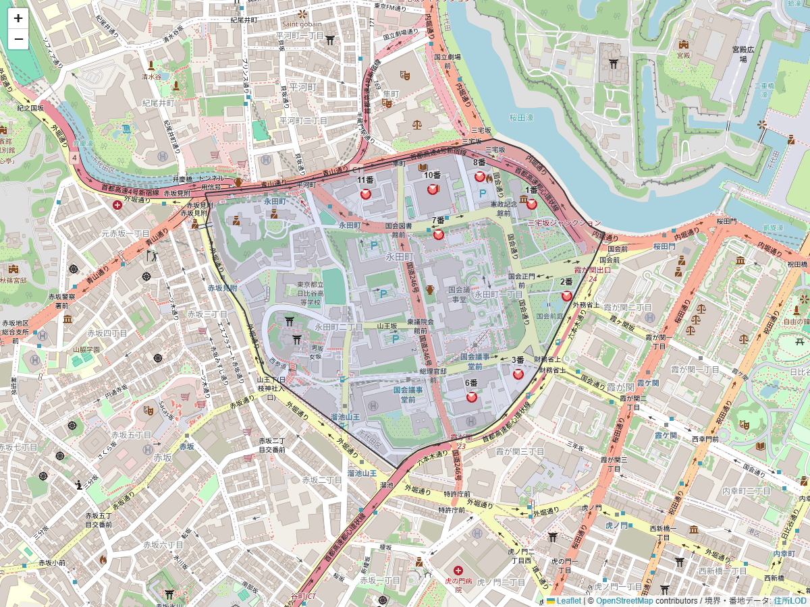
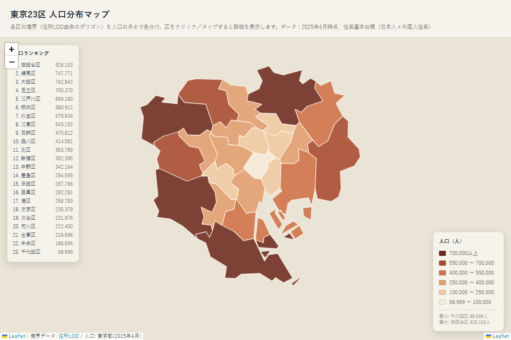
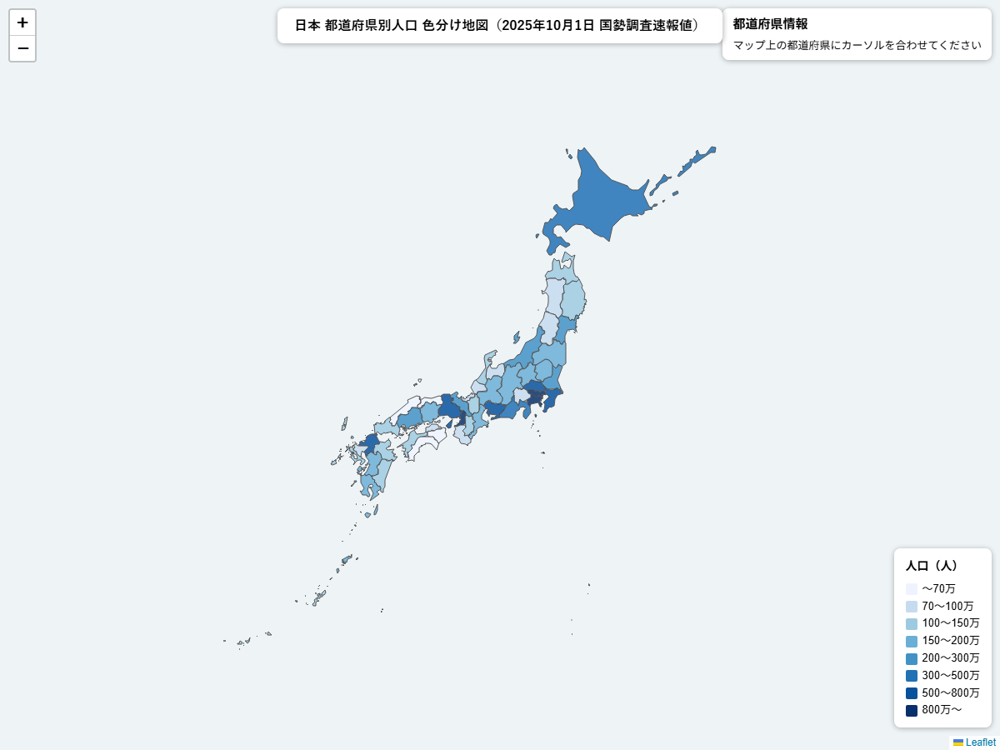
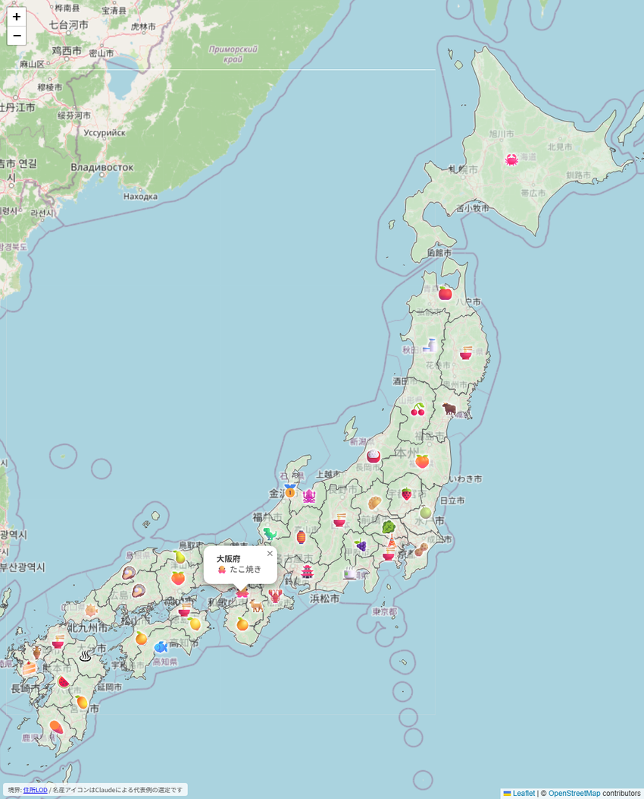

# 住所LOD MCPサーバー

日本の住所を検索し、その位置をポリゴンまたはポイントで取得できる、ローカル実行(stdio)のMCPサーバーです。[住所LOD](https://uedayou.net/loa/)を利用しており、認証不要・オープンライセンスのデータソースなのですぐに使い始められます。

Claude Desktop や Claude Code のようなMCP対応クライアントから、次のようなことができます:

- 住所の部分一致検索(例:「永田町」→候補一覧)
- 住所からポリゴン/座標の取得(都道府県〜丁目はポリゴン、番地は代表点)
- 複数住所をまとめて1回のGeoJSON `FeatureCollection`として取得(地図表示向け。隣接ポリゴン間の境界を保ったまま座標点数を間引ける)
- 住所階層のドリルダウン(都道府県→市区町村→町丁目)
- 町丁目配下の番地一覧
- 緯度経度からの近傍住所検索(逆ジオコーディング)
- 47都道府県の正式名称一覧取得
- 複数住所の取得結果をローカルファイルへ直接保存(1MBのレスポンス上限を回避)
- 住所の面積算出(km^2、複数件まとめて算出・比較も可能)

郡名・政令指定都市の市名の省略、全角数字・漢数字・異体字(ケ/ヶ/ヵ)などの表記ゆれも自動的に補完します。

## Tools

| Tool | 概要 |
|---|---|
| `search_address` | 住所の部分一致検索 |
| `get_address_location` | 住所1件のポリゴン/座標を取得。`simplify`で座標点数を間引ける |
| `get_address_locations` | 複数住所をまとめて取得(最大50件)。地図表示向けで、隣接ポリゴン間の境界を保ったまま`simplify`で間引ける |
| `list_child_addresses` | 住所階層のドリルダウン(都道府県→市区町村→町丁目) |
| `list_banchi` | 町丁目配下の番地一覧 |
| `reverse_geocode_address` | 緯度経度→近傍住所(逆ジオコーディング) |
| `list_prefectures` | 47都道府県の正式名称一覧 |
| `save_address_locations_to_file` | `get_address_locations`と同じ複数住所取得だが、結果を会話に含めずローカルファイルへ書き出す。1MBのレスポンス上限を回避できるため、47都道府県すべてを分割せず1回で保存できる |
| `get_address_areas` | 1件以上の住所の面積(km^2)をまとめて算出。町丁目・丁目レベルや複数件の合計・比較など、公表統計に載っていない値を求めるのに向く |

号(建物番号)は元データに存在しないため、どのToolを使っても番地(街区)レベルまでが限界です。

## 必要環境

- Node.js 18.17以上

## セットアップ

```bash
npm install
npm run dev   # tsx watch でホットリロード起動(stdio)
```

## Claude Desktop への登録

事前にビルドしておきます:

```bash
npm run build
```

`claude_desktop_config.json`に以下を追加します(`args`のパスは実際にリポジトリを配置した場所の絶対パスに書き換えてください):

```json
{
  "mcpServers": {
    "loa-mcp-server": {
      "command": "node",
      "args": ["/path/to/loa-mcp-server/dist/index.js"]
    }
  }
}
```

Windowsの場合はパス区切りをエスケープした`\\`で指定します(例: `"C:\\path\\to\\loa-mcp-server\\dist\\index.js"`)。

> **Tips**: Claude Desktopは「日本地図を作りたい」のような依頼でも、このMCPサーバーを使わずWeb検索に頼ろうとすることがあります。プロンプトに「**住所LOD MCPサーバーを使って**」のようにサーバー名を明示すると、確実にこのサーバーのToolが呼ばれます。

## Claude Code への登録

プロジェクト直下の`.mcp.json`に登録済みです。このリポジトリをClaude Codeで開くと自動的に検出されます。

## 使い方の例

プロンプトの冒頭に「**住所LOD MCPサーバーを使って**」と入れると、このMCPサーバーが確実に呼ばれやすくなります(Claude DesktopがWeb検索など別の手段に頼ろうとすることがあるため)。

> 「住所LOD MCPサーバーを使って、永田町の場所を教えて」

- `search_address(query:"永田町", prefecture:"東京都")` で候補を検索
- 候補の`uri`を`get_address_location`に渡してポリゴン/座標を取得

> 「住所LOD MCPサーバーを使って、東京23区すべてをポリゴンとして地図に表示したい」

- `list_child_addresses(parent:"東京都")` で市区町村一覧を取得し、「〇〇区」の23件の`uri`を選ぶ
- `get_address_locations(addresses:[23件のuri], simplify:"medium")` で1回の`FeatureCollection`としてまとめて取得
- `simplify`はトポロジーを保持するため、区同士の境界に隙間ができない

> **Tips**: Claude Codeのように1回のTool呼び出し結果に約1MBのような厳しい上限がない環境では、`simplify`を省略(既定値`none`)して離島まで含む高精度な形状のまま取得できます。実際にClaude Codeで「住所LOD MCPサーバーを使って、東京23区すべてをポリゴンとしてsimplifyなしで地図に表示したい」というプロンプトで成功しています。Claude Desktop等、応答サイズに制限がある環境では引き続き`simplify:"low"`/`"medium"`を推奨します。

> 「住所LOD MCPサーバーを使って、東京都千代田区永田町1丁目に含まれる番地すべての位置を地図に表示したい」

- `list_banchi(town:"東京都千代田区永田町", chome:1)` で番地一覧を取得
- 各番地を住所文字列に組み立て(例:「東京都千代田区永田町1丁目6」)、`get_address_locations(addresses:[組み立てた住所一覧])` でまとめて取得
- 番地レベルはポリゴンを持たず代表点(Point)のみが返る



*上記はClaude Codeがこのプロンプトから生成したHTML(Leaflet地図)のキャプチャです。町丁目のポリゴン(青枠)の中に各番地の代表点(赤丸)がラベル付きで表示されています。*

> 「住所LOD MCPサーバーを使って、この緯度経度(35.6766, 139.7456)はどこの住所か教えて」

- `reverse_geocode_address(lat:35.6766, long:139.7456)` で近傍候補(町丁目レベル)を取得

> 「住所LOD MCPサーバーを使って、東京23区のうち面積が10km^2以上の区を教えて」

- `list_child_addresses(parent:"東京都")` で23区の`uri`を取得し、`get_address_areas(addresses:[23件のuri])` でまとめて面積を算出
- このような複数件を横断した集計・比較は、都道府県・市区町村レベルの単純な面積(公表統計でよく知られている)よりも`get_address_areas`の価値が出やすい使い方です。町丁目・丁目レベルの面積(公表資料に載っていないことが多い)を尋ねる場合も同様です
- 算出される面積は住所LODのポリゴンからの近似値(緯度によるcos補正込みの平面近似)であり、国土地理院等の公式統計とは完全には一致しません

> 「住所LOD MCPサーバーを使って、大阪市で最も面積が大きい区を教えて」

- `list_child_addresses(parent:"大阪府大阪市")` で大阪市24区の`uri`を取得し、`get_address_areas(addresses:[24件のuri])` でまとめて面積を算出して比較
- 実際に試すと「住之江区(約20.73km^2)、此花区(約19.35km^2)、平野区(約15.31km^2)」の順に大きいという結果が得られます(実データ検証済み)

> 「住所LOD MCPサーバーを使って、大阪府大阪市住之江区と東京都北区、どちらの面積が大きいか教えて」

- `get_address_areas(addresses:["大阪府大阪市住之江区","東京都北区"])` で2件まとめて面積を算出して比較
- 実際に試すと、大阪府大阪市住之江区(約20.73km^2)が東京都北区(約20.66km^2)よりわずかに大きく、差は約0.08km^2という結果が得られます(実データ検証済み)
- このように、都市も自治体の種類も異なる任意の複数の住所を1回のTool呼び出しでまとめて指定し、ポリゴンの大きさをそのまま比較できます

> 「住所LOD MCPサーバーを使って、47都道府県すべてを結合した日本地図を作りたい」

- `list_prefectures()` で47都道府県の正式名称を取得(手で列挙すると書き漏らしが起きるため、必ずこのToolを使う)
- 陸地のまとまりで5グループに分ける: 北海道/本州/四国/九州/沖縄
- 各グループごとに `get_address_locations(addresses:[グループ内の県], dropSmallIslands:true, simplify:"medium")` を呼ぶ(計5回)
- 47都道府県を1回にまとめると多くのMCPクライアントの1MB制限を超えるため、必ず5分割する

戻り値のgeometryは標準的なGeoJSON(RFC 7946)なので、Leafletの`L.geoJSON()`やMapLibre GL JS、deck.gl等の地図ライブラリにそのまま渡せます。

### 47都道府県すべてを結合した日本地図についての補足

Claude Desktop等の多くのMCPクライアントには、Tool呼び出し1回の結果が約1MBを超えると失敗する制限があります。北海道・本州・四国・九州・沖縄は互いに海で隔てられているため、上記の通り5グループに分ければ通常は境界に隙間は生じません(唯一の例外: 岡山県⇔香川県は瀬戸内海上の小島の行政界を共有しており、この1境界だけはズレる可能性があります)。サーバー側にも、応答が大きくなりすぎる場合に自動でより軽量な設定へ切り替える安全弁がありますが、47都道府県すべてを1回にまとめるケースだけはこの安全弁でも救えないため、必ず5分割してください。

### 47都道府県分のGeoJSONファイルが欲しいだけの場合

> 「住所LOD MCPサーバーを使って、47都道府県すべてのポリゴンを1つのGeoJSONファイルに保存して」

- `list_prefectures()` → `save_address_locations_to_file(addresses:[47件], outputPath:"japan.geojson")` を1回呼ぶだけでよい
- `save_address_locations_to_file`は結果を会話に返さずローカルファイルへ直接書き出すため、1MBのレスポンス上限を受けない。5グループに分割する必要はなく、離島を含む正確な形状のまま1回で保存できる
- **「地図を作りたい/表示したい/見せてほしい」という依頼にはこのToolを使わないこと**。書き出したファイルの中身は会話に含まれずClaude自身は読めないため、地図(HTMLやアプリ)を描画できない。その場合は上記の「47都道府県すべてを結合した日本地図を作りたい」の例(`get_address_locations`を5グループに分割)を使う。「ファイルとして保存/エクスポートしてほしい」のように、ファイルを受け取るだけでよい依頼のときだけこちらを使う

> **Tips**: `save_address_locations_to_file`はファイルへ直接書き出すため、Claude Codeのような環境では応答サイズの制約自体がなく、`simplify`を省略しても`dropSmallIslands`なしの高精細な形状のまま保存できます。実際にClaude Codeで「住所LOD MCPサーバーを使って、47都道府県すべてのポリゴンをsimplifyせずに1つのGeoJSONファイルに保存して」というプロンプトで、離島を含む正確な形状のまま約24MBのGeoJSONファイルの生成に成功しています。

### 応用事例: 境界データに外部の統計データを重ねた色分け地図

> 「住所LOD MCPサーバーを使って東京23区のポリゴンを取得して、それぞれの人口を色分け地図にしたい」

- `list_child_addresses(parent:"東京都")` で23区の`uri`を取得し、`get_address_locations(addresses:[23件のuri], simplify:"medium")` で境界(GeoJSON)をまとめて取得
- 人口データは住所LODの範囲外(行政区域の境界・住所を扱うデータソースであり、統計データは持たない)。Claudeが用意した人口データを、取得した境界の`properties`(区名等)と突き合わせて色分け(コロプレス図)を作成する
- このサーバーは境界データの取得までを担い、統計データの用意・重ね合わせ・描画はClaude側の仕事という役割分担になる。実際にClaude Desktopでこのプロンプトを使い、意図通りの人口別色分け地図が作成できることを確認済み



*上記はClaude Desktopがこのプロンプトから生成したHTML(Leaflet地図)のキャプチャです。*

> 「住所LOD MCPサーバーを使って47都道府県すべてのポリゴンを取得して、それぞれの人口を色分け地図にしたい」

- 上記の「47都道府県すべてを結合した日本地図を作りたい」と同じ手順(`list_prefectures()` → 5グループに分けて`get_address_locations`を5回)で境界データを取得し、23区の例と同様に人口データ(住所LODの範囲外、Claude側で用意)を重ねて色分け地図にする
- **既知の注意点**: 取得データ量を抑えようとして、Claudeが一部の地域(実例では四国・九州・沖縄)を自己判断でポリゴンではなく代表点の円マーカーに置き換えてしまうことがある。これはこのサーバーのTool呼び出し・レスポンスの時点では起きておらず(データ自体は正しく全都道府県分取得できている)、その後のHTML等を組み立てる生成過程でのClaude側の判断であるため、サーバー側から検知・防止することはできない
- **回避方法**: 一部の地域が円マーカー等に簡略化されていたら、「四国・九州・沖縄も省略せずポリゴンで表示して」のように、取得済みのデータをそのまま使うよう明示的に指示し直す。実際にこの追加指示で全都道府県がポリゴン表示に修正されることを確認済み



*上記はClaude Desktopがこのプロンプトから生成したHTML(Leaflet地図)のキャプチャです。*

### 応用事例: 都道府県ごとの名産アイコンを重ねた地図

> 「住所LOD MCPサーバーを使って47都道府県すべてのポリゴンを取得して、それぞれの都道府県の名産を表すアイコンを一つ、ポリゴンの中央に表示したい」

- `list_prefectures()` → `get_address_locations(addresses:[47件])` で47都道府県の境界(GeoJSON)をまとめて取得
- 各都道府県の名産品(データ元は住所LODの範囲外、Claudeが選定)を表す絵文字アイコンを、境界データの代表点(中央)に配置してLeaflet地図として描画
- Claude Codeのように応答サイズの制約がない環境で実行したため、`simplify`なしの高精細な形状のまま47都道府県すべてを取得できている(上記Tips参照)



*上記はClaude Codeがこのプロンプトから生成したHTML(Leaflet地図)のキャプチャです(大阪府のアイコンをクリックした状態)。*

## 元データについて

このMCPサーバーは[住所LOD](https://uedayou.net/loa/)が公開するデータを利用しています。以下は**2026年8月時点**の情報です。住所LOD側の更新により変わることがあるため、最新情報は[住所LODサイト](https://uedayou.net/loa/)を参照してください。

- **データ版**: 2026年版(`https://uedayou.net/loa/`で本番稼働中)
- **ライセンス**: CC BY 4.0互換(出典表記のもとで商用利用・二次配布・加工可)

| データ | 出典 | 基準日 |
|---|---|---|
| 都道府県・市区町村 | 国交省 国土数値情報 | 2025年版(2025-01-01) |
| 町丁目 | 総務省統計局 小地域境界データ | 2020年国勢調査版(5年ごと更新) |
| 番地 | 国交省 位置参照情報 街区レベル | 令和6年版(2024年基準) |

号(建物番号)は元データに存在しないため含まれません。また番地データは都市計画区域内が中心で、農村・山間部など区域外は網羅されていません。

## 免責事項

- 本ソフトウェアは現状有姿(as-is)で提供され、開発者はその動作・正確性・可用性についていかなる保証も行いません。
- 本ソフトウェアが問い合わせる[住所LOD](https://uedayou.net/loa/)は無償で公開されている共有のサービスです。多数のユーザーからのアクセスが同時に集中した場合、または特定の利用者から大量のアクセスがあった場合、住所LOD側の判断でアクセスしづらくなる、または利用が制限されることがあります。
- 住所LODが提供するデータについては、その正確性の維持に努められていますが、内容の正確性・完全性・最新性は保証されません。本ソフトウェアの出力を利用する際は、その正誤・妥当性を利用者自身の責任で判断してください。
- 以上を踏まえ、本ソフトウェアおよび住所LODは各自の判断と責任においてご利用いただき、その結果生じた損害について開発者は責任を負いません。

## ライセンス

本ソフトウェア(コード)は[MIT License](LICENSE)のもとで公開しています。利用しているデータ([住所LOD](https://uedayou.net/loa/))のライセンスは上記「元データについて」の通り別途CC BY 4.0互換です。

## 開発

```bash
npm run typecheck  # 型チェック
npm test           # vitest
npm run build      # dist/ へコンパイル
npm run inspector  # MCP Inspector で対話的に確認
```
