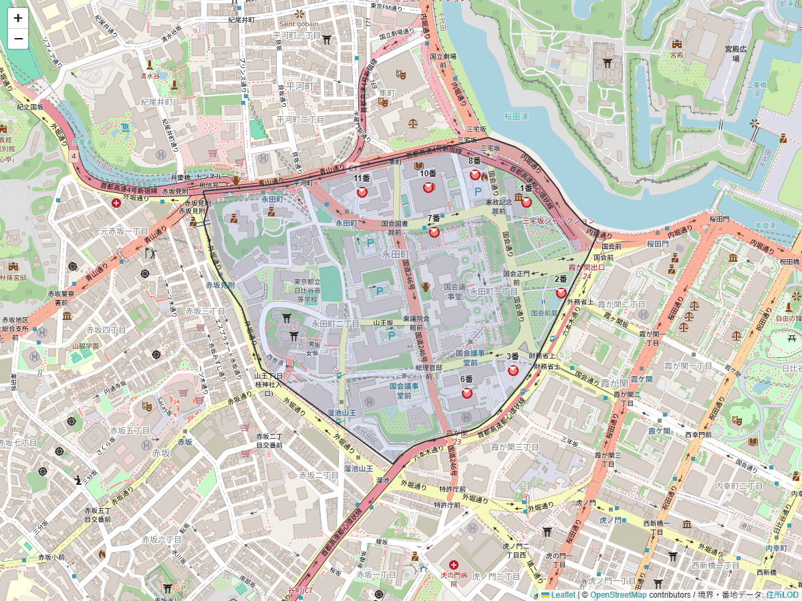
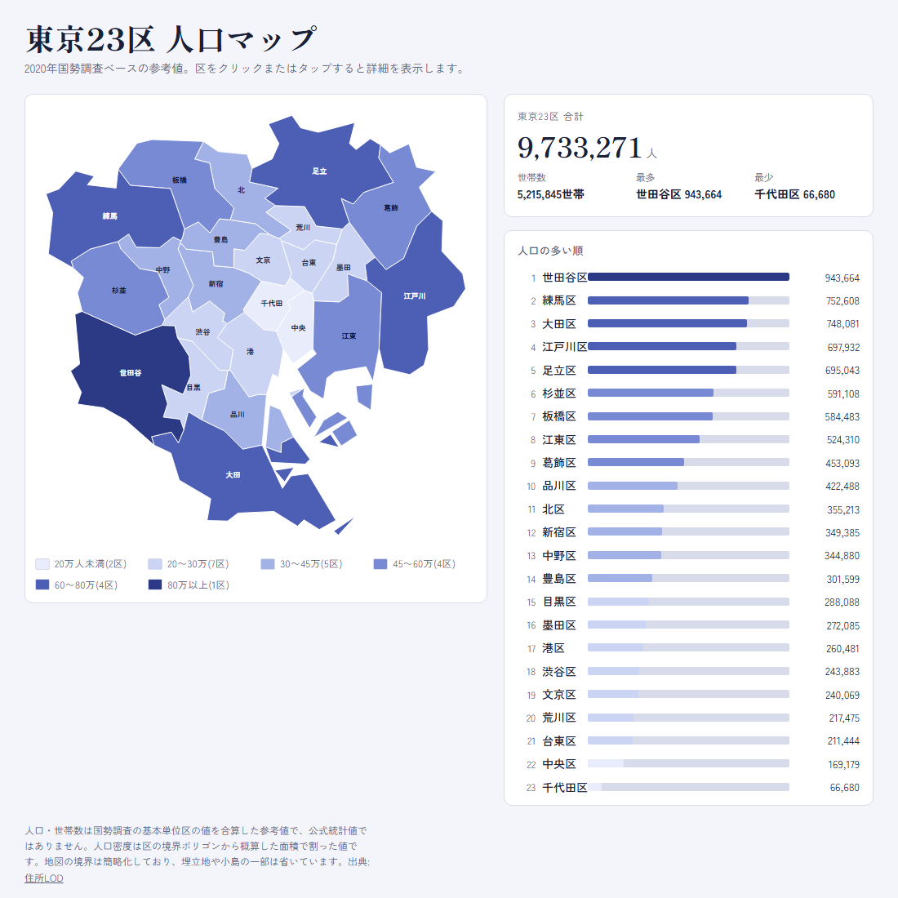
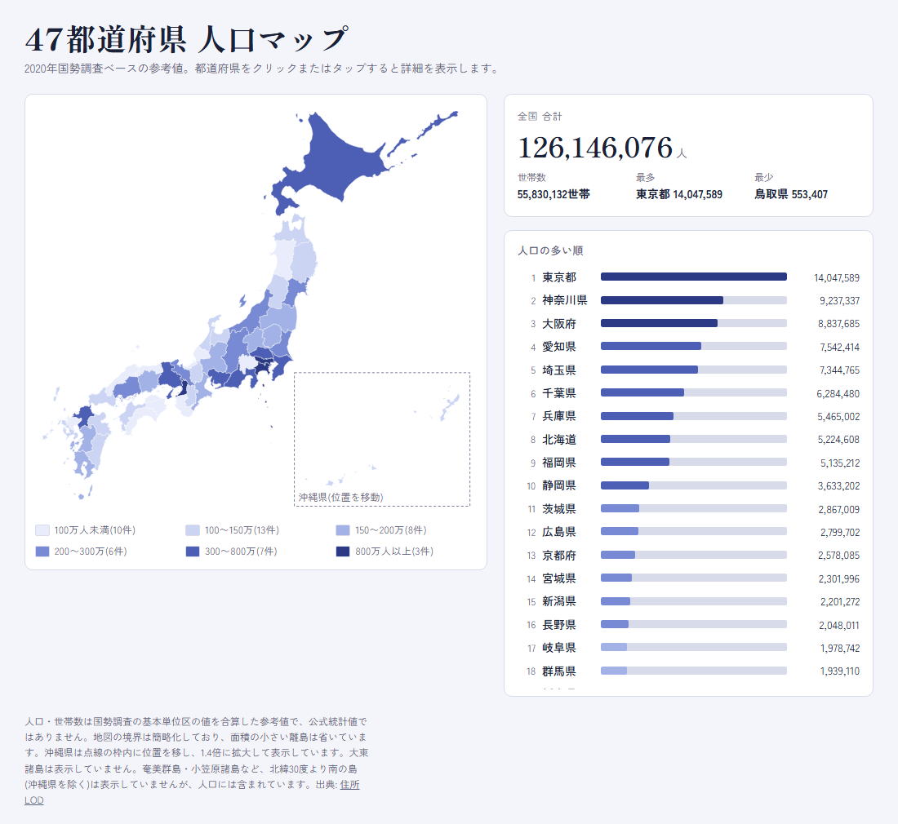
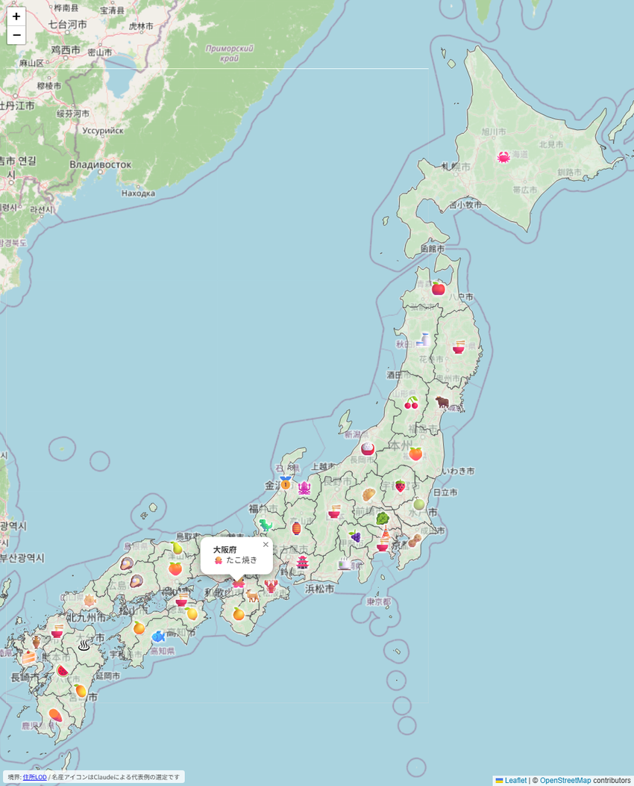

# 住所LOD MCPサーバー

[](https://github.com/uedayou/loa-mcp-server/actions/workflows/test.yml)

日本の住所を検索し、その位置をポリゴンまたはポイントで取得できる、ローカル実行(stdio)のMCPサーバーです。[住所LOD](https://uedayou.net/loa/)を利用しており、認証不要・オープンライセンスのデータソースなのですぐに使い始められます。

Claude Desktop や Claude Code のようなMCP対応クライアントから、次のようなことができます:

- 住所の部分一致検索(例:「永田町」→候補一覧)
- 住所からポリゴン/座標の取得(都道府県〜丁目はポリゴン、番地は代表点)
- 複数住所をまとめて1回のGeoJSON `FeatureCollection`として取得(地図表示向け。隣接ポリゴン間の境界を保ったまま座標点数を間引ける)
- 住所階層のドリルダウン(都道府県→市区町村→町丁目)
- 町丁目配下の番地一覧
- 緯度経度からの近傍住所検索(逆ジオコーディング)
- 47都道府県の正式名称一覧取得
- 複数住所の取得結果をローカルファイルへ直接保存(1MBのレスポンス上限を回避)
- 住所の面積算出(km^2、複数件まとめて算出・比較も可能)

郡名・政令指定都市の市名の省略、全角数字・漢数字・異体字(ケ/ヶ/ヵ)などの表記ゆれも自動的に補完します。

## Tools

| Tool | 概要 |
|---|---|
| `search_address` | 住所の部分一致検索 |
| `get_address_location` | 住所1件のポリゴン/座標を取得。`simplify`で座標点数を間引ける |
| `get_address_locations` | 複数住所をまとめて取得(最大50件)。地図表示向けで、隣接ポリゴン間の境界を保ったまま`simplify`で間引ける |
| `list_child_addresses` | 住所階層のドリルダウン(都道府県→市区町村→町丁目)。各要素に人口・世帯数が付き、`sortBy`で人口順ランキングにもできる |
| `list_banchi` | 町丁目配下の番地一覧 |
| `reverse_geocode_address` | 緯度経度→近傍住所(逆ジオコーディング) |
| `list_prefectures` | 47都道府県の正式名称一覧 |
| `save_address_locations_to_file` | `get_address_locations`と同じ複数住所取得だが、結果を会話に含めずローカルファイルへ書き出す。1MBのレスポンス上限を回避できるため、47都道府県すべてを分割せず1回で保存できる |
| `get_address_areas` | 1件以上の住所の面積(km^2)をまとめて算出。町丁目・丁目レベルや複数件の合計・比較など、公表統計に載っていない値を求めるのに向く |
| `save_child_address_locations_to_file` | 親(例: 東京都新宿区)を1つ指定するだけで、直下の子(町丁目)すべての位置を1つのGeoJSONファイルへ書き出す。50件を超える親でも1回で済み、子のuriを列挙する必要がない |
| `get_address_populations` | 1件以上の住所の人口・世帯数(2020年国勢調査の参考値)と、面積・人口密度をまとめて取得。丁目単位の人口はこのToolでのみ取得できる |

`get_address_location` / `get_address_locations` / `save_address_locations_to_file` が返すGeoJSON Featureの`properties`にも、人口・世帯数(`population` / `households`)が含まれます。人口・世帯数は国勢調査の基本単位区を合算した**参考値**であり、公式統計値ではありません。この旨は各Toolの結果に注記として付くほか、GeoJSON本体のトップレベルにも`population_note`として埋め込まれ、`save_address_locations_to_file`で書き出したファイルにも残ります。

号(建物番号)は元データに存在しないため、どのToolを使っても番地(街区)レベルまでが限界です。

## 必要環境

- Node.js 18.17以上

## セットアップ

```bash
npm install
npm run dev   # tsx watch でホットリロード起動(stdio)
```

## Claude Desktop への登録

事前にビルドしておきます:

```bash
npm run build
```

`claude_desktop_config.json`に以下を追加します(`args`のパスは実際にリポジトリを配置した場所の絶対パスに書き換えてください):

```json
{
  "mcpServers": {
    "loa-mcp-server": {
      "command": "node",
      "args": ["/path/to/loa-mcp-server/dist/index.js"]
    }
  }
}
```

Windowsの場合はパス区切りをエスケープした`\\`で指定します(例: `"C:\\path\\to\\loa-mcp-server\\dist\\index.js"`)。

> **Tips**: Claude Desktopは「日本地図を作りたい」のような依頼でも、このMCPサーバーを使わずWeb検索に頼ろうとすることがあります。プロンプトに「**住所LOD MCPサーバーを使って**」のようにサーバー名を明示すると、確実にこのサーバーのToolが呼ばれます。

## Claude Code への登録

プロジェクト直下の`.mcp.json`に登録済みです。このリポジトリをClaude Codeで開くと自動的に検出されます。

## その他のMCPクライアントでの動作

このMCPサーバーはstdioで通信する標準的なMCP実装のため、Claude Desktop / Claude Code以外のMCP対応クライアントからも利用できます。[LM Studio](https://lmstudio.ai/)からの接続・動作を確認済みです。

## プロンプト例

「何ができるか」ごとに、プロンプトの例とその説明をまとめています。各プロンプトの冒頭の「**住所LOD MCPサーバーを使って**」は、このMCPサーバーを確実に呼ばせるための書き出しです(Claude DesktopがWeb検索など別の手段に頼ろうとすることがあるため)。

### 住所の場所(ポリゴン・座標)がわかる

**プロンプト**

```
住所LOD MCPサーバーを使って、永田町の場所を教えて
```

**説明**

- `search_address(query:"永田町", prefecture:"東京都")` で候補を検索します
- 候補の`uri`を`get_address_location`に渡して、ポリゴン/座標を取得します

### 緯度経度から住所がわかる

**プロンプト**

```
住所LOD MCPサーバーを使って、この緯度経度(35.6766, 139.7456)はどこの住所か教えて
```

**説明**

- `reverse_geocode_address(lat:35.6766, long:139.7456)` で、近傍の候補(町丁目レベル)を取得します

### 住所のポリゴンを地図に表示できる

#### 東京23区すべて

**プロンプト**

```
住所LOD MCPサーバーを使って、東京23区すべてをポリゴンとして地図に表示したい
```

**説明**

- `list_child_addresses(parent:"東京都")` で市区町村一覧を取得し、「〇〇区」の23件の`uri`を選びます
- `get_address_locations(addresses:[23件のuri], simplify:"medium")` で、1回の`FeatureCollection`としてまとめて取得します
- `simplify`はトポロジーを保持するため、区同士の境界に隙間ができません
- 戻り値のgeometryは標準的なGeoJSON(RFC 7946)なので、Leafletの`L.geoJSON()`やMapLibre GL JS、deck.gl等の地図ライブラリにそのまま渡せます
- **Tips**: Claude Codeのように1回のTool呼び出し結果に約1MBのような厳しい上限がない環境では、`simplify`を省略(既定値`none`)して離島まで含む高精度な形状のまま取得できます。実際にClaude Codeで「住所LOD MCPサーバーを使って、東京23区すべてをポリゴンとしてsimplifyなしで地図に表示したい」というプロンプトで成功しています。Claude Desktop等、応答サイズに制限がある環境では引き続き`simplify:"low"`/`"medium"`を推奨します

#### 町丁目に含まれる番地すべて

**プロンプト**

```
住所LOD MCPサーバーを使って、東京都千代田区永田町1丁目に含まれる番地すべての位置を地図に表示したい
```

**説明**

- `list_banchi(town:"東京都千代田区永田町", chome:1)` で番地一覧を取得します
- 各番地を住所文字列に組み立て(例:「東京都千代田区永田町1丁目6」)、`get_address_locations(addresses:[組み立てた住所一覧])` でまとめて取得します
- 番地レベルはポリゴンを持たず、代表点(Point)のみが返ります



*上記はClaude Codeがこのプロンプトから生成したHTML(Leaflet地図)のキャプチャです。町丁目のポリゴン(青枠)の中に各番地の代表点(赤丸)がラベル付きで表示されています。*

#### 47都道府県を結合した日本地図

**プロンプト**

```
住所LOD MCPサーバーを使って、47都道府県すべてを結合した日本地図を作りたい
```

**説明**

- `list_prefectures()` で47都道府県の正式名称を取得します(手で列挙すると書き漏らしが起きるため、必ずこのToolを使います)
- 陸地のまとまりで5グループに分けます: 北海道/本州/四国/九州/沖縄
- 各グループごとに `get_address_locations(addresses:[グループ内の県], dropSmallIslands:true, simplify:"medium")` を呼びます(計5回)
- 47都道府県を1回にまとめると多くのMCPクライアントの1MB制限を超えるため、必ず5分割します
- 戻り値のgeometryは標準的なGeoJSON(RFC 7946)なので、Leafletの`L.geoJSON()`やMapLibre GL JS、deck.gl等の地図ライブラリにそのまま渡せます

**補足: なぜ5分割するのか**

Claude Desktop等の多くのMCPクライアントには、Tool呼び出し1回の結果が約1MBを超えると失敗する制限があります。北海道・本州・四国・九州・沖縄は互いに海で隔てられているため、上記の通り5グループに分ければ通常は境界に隙間は生じません(唯一の例外: 岡山県⇔香川県は瀬戸内海上の小島の行政界を共有しており、この1境界だけはズレる可能性があります)。サーバー側にも、応答が大きくなりすぎる場合に自動でより軽量な設定へ切り替える安全弁がありますが、47都道府県すべてを1回にまとめるケースだけはこの安全弁でも救えないため、必ず5分割してください。

### GeoJSONファイルを保存できる

**プロンプト**

```
住所LOD MCPサーバーを使って、47都道府県すべてのポリゴンを1つのGeoJSONファイルに保存して
```

**説明**

- `list_prefectures()` → `save_address_locations_to_file(addresses:[47件], outputPath:"japan.geojson")` を1回呼ぶだけで済みます
- `save_address_locations_to_file`は結果を会話に返さずローカルファイルへ直接書き出すため、1MBのレスポンス上限を受けません。5グループに分割する必要はなく、離島を含む正確な形状のまま1回で保存できます
- **「地図を作りたい/表示したい/見せてほしい」という依頼にはこのToolを使わないこと**。書き出したファイルの中身は会話に含まれずClaude自身は読めないため、地図(HTMLやアプリ)を描画できません。その場合は「住所のポリゴンを地図に表示できる」の「47都道府県を結合した日本地図」の例(`get_address_locations`を5グループに分割)を使います。「ファイルとして保存/エクスポートしてほしい」のように、ファイルを受け取るだけでよい依頼のときだけこちらを使います
- **Tips**: `save_address_locations_to_file`はファイルへ直接書き出すため、Claude Codeのような環境では応答サイズの制約自体がなく、`simplify`を省略しても`dropSmallIslands`なしの高精細な形状のまま保存できます。実際にClaude Codeで「住所LOD MCPサーバーを使って、47都道府県すべてのポリゴンをsimplifyなしで1つのGeoJSONファイルに保存して」というプロンプトで、離島を含む正確な形状のまま約24MBのGeoJSONファイルの生成に成功しています

### 親の直下の子すべてをGeoJSONファイルに保存できる

**プロンプト**

```
住所LOD MCPサーバーを使って、東京都新宿区の町丁目すべてを1つのGeoJSONファイルに保存して
```

**説明**

- `save_child_address_locations_to_file`が、親(ここでは新宿区)の直下の子(町丁目)を全件取得し、1つのGeoJSON `FeatureCollection` としてローカルファイルへ書き出します。親を1つ指定するだけで済み、子の`uri`を手で列挙する必要はありません(書き漏らしが起きません)
- 実際に試すと、新宿区の町丁目94件が約6秒で、約0.25MBのファイルとして保存できました(実データ検証済み)。`save_address_locations_to_file`は1回50件までなので、同じことを行うには2回に分けて、できた2つのファイルを結合する必要があります
- 子が200件を超える親でも全件が対象です(`list_child_addresses`は最大200件)。東京都内で子が最も多いのは八王子市の119件で、200件を超える親はありませんが、他の道府県では三重県桑名市の222件、富山県富山市の1,154件で確認済みです。富山市の1,154件は約1分かかります
- `simplify`を指定すると、子全体を1つのトポロジーとして簡略化するため、隣接する町丁目同士の境界に隙間はできません。出力は**子だけ**で、親自身(ここでは新宿区全体)のポリゴンは含まれません(親のポリゴンが子を覆うと、地図上で子をクリックできなくなるため)。親の形も必要な場合は、`get_address_location`などで別途取得します
- 対象は**直下の子のみ**です(市なら町丁目、都道府県なら市区町村、政令指定都市なら区)。子の件数が`maxChildren`(既定1,200件)を超える親は、何も書き出さずエラーになります。その場合は、より下位の親(例: 市ではなく区)に絞って呼び直してください
- 各Featureの`properties`には、人口・世帯数(参考値)も含まれます
- **「地図を作りたい/表示したい」という依頼にはこのToolを使わないこと**。書き出したファイルの中身は会話に含まれずClaude自身は読めないためです。ファイルとして受け取るだけでよい依頼のときだけ使います

### 面積がわかる・比較できる

#### 東京23区のうち面積が10km²以上の区

**プロンプト**

```
住所LOD MCPサーバーを使って、東京23区のうち面積が10km^2以上の区を教えて
```

**説明**

- `list_child_addresses(parent:"東京都")` で23区の`uri`を取得し、`get_address_areas(addresses:[23件のuri])` でまとめて面積を算出します
- このような複数件を横断した集計・比較は、都道府県・市区町村レベルの単純な面積(公表統計でよく知られている)よりも`get_address_areas`の価値が出やすい使い方です。町丁目・丁目レベルの面積(公表資料に載っていないことが多い)を尋ねる場合も同様です
- 算出される面積は住所LODのポリゴンからの近似値(緯度によるcos補正込みの平面近似)であり、国土地理院等の公式統計とは完全には一致しません

#### 大阪市で最も面積が大きい区

**プロンプト**

```
住所LOD MCPサーバーを使って、大阪市で最も面積が大きい区を教えて
```

**説明**

- `list_child_addresses(parent:"大阪府大阪市")` で大阪市24区の`uri`を取得し、`get_address_areas(addresses:[24件のuri])` でまとめて面積を算出して比較します
- 実際に試すと「住之江区(約20.73km^2)、此花区(約19.35km^2)、平野区(約15.31km^2)」の順に大きいという結果が得られます(実データ検証済み)

#### 異なる都市の2つの区の面積比較

**プロンプト**

```
住所LOD MCPサーバーを使って、大阪府大阪市住之江区と東京都北区、どちらの面積が大きいか教えて
```

**説明**

- `get_address_areas(addresses:["大阪府大阪市住之江区","東京都北区"])` で、2件まとめて面積を算出して比較します
- 実際に試すと、大阪府大阪市住之江区(約20.73km^2)が東京都北区(約20.66km^2)よりわずかに大きく、差は約0.08km^2という結果が得られます(実データ検証済み)
- このように、都市も自治体の種類も異なる任意の複数の住所を1回のTool呼び出しでまとめて指定し、ポリゴンの大きさをそのまま比較できます

### 人口・世帯数がわかる

住所LODが持つ人口・世帯数(2020年国勢調査の参考値)を、そのまま取得・比較・ランキングできます。Web検索や一般知識で人口を補う必要はありません。いずれも国勢調査の基本単位区を合算した**参考値**で、公式統計値ではありません(結果にはその旨の注記が付きます)。

**プロンプト**

```
住所LOD MCPサーバーを使って、神奈川県横浜市西区みなとみらい3丁目の位置と人口・世帯数を教えて
```

**説明**

- `get_address_location` が返すGeoJSON Featureの`properties`に、`population`(人口)と`households`(世帯数)が含まれます(みなとみらい3丁目は人口459・世帯数195)
- 人口・世帯数を含むGeoJSONには、参考値である旨が最上位の`population_note`として埋め込まれ、`save_address_locations_to_file`で書き出したファイルにも残ります。Claudeが回答や地図の凡例に「参考値」と併記するよう指示してありますが、LLMが必ず従う保証はありません

### 人口ランキングができる

#### 市区町村の人口ランキング

**プロンプト**

```
住所LOD MCPサーバーを使って、神奈川県で人口の多い市区町村トップ5を教えて
```

**説明**

- `list_child_addresses(parent:"神奈川県", sortBy:"population", limit:5)` の1回の呼び出しで、横浜市(3,777,491)・川崎市(1,538,262)・相模原市(725,493)・藤沢市(436,905)・横須賀市(388,078)が得られます
- 並べ替えはSPARQL側で行うため、`limit`が小さくても全子要素のうち上位N件が返ります。世帯数順にしたい場合は`sortBy:"households"`を使います
- 郡名・政令市名を省略した親(例:「東京都瑞穂町」)でも、自動補完した上で人口順に並べられます

#### 都道府県の人口ランキング

**プロンプト**

```
住所LOD MCPサーバーを使って、都道府県を人口の多い順に上位5つ教えて
```

**説明**

- 親を指定しない全国ランキング専用のToolはありません。`list_prefectures`の結果を`get_address_populations`に渡して並べ替える形になります
- 東京都14,047,589・神奈川県9,237,337・大阪府8,837,685・愛知県7,542,414・埼玉県7,344,765が得られます

### 人口密度がわかる

**プロンプト**

```
住所LOD MCPサーバーを使って、東京23区の人口と人口密度を求めて、人口密度が高い順に並べて
```

**説明**

- `get_address_populations(addresses:[23件])` で、人口・世帯数に加えて、ポリゴンから算出した面積・人口密度(人/km^2)をまとめて取得できます(最大50件)
- 実際に試すと、23区の人口合計は9,733,271、人口密度が最も高いのは豊島区(約23,128人/km^2)、最も低いのは千代田区(約5,860人/km^2)という結果が得られます(実データ検証済み)
- **丁目単位の人口は`get_address_populations`でしか取得できません**(SPARQLの人口は都道府県〜町丁目までで、丁目・番地にはありません)。番地レベルは人口がないため、理由付きで対象外として報告されます

### 人口で色分けした地図ができる

人口・世帯数は住所LODが持っており、取得した各Featureの`properties.population` / `properties.households`にそのまま含まれます。人口データを自前で用意したり、Web検索で探したりしなくても、色分け(コロプレス図)を作成できます。このサーバーが担うのは境界データと人口・世帯数の取得までで、重ね合わせ・描画はClaude側の仕事です。所得・産業別データなど国勢調査の人口・世帯数以外の統計は住所LODの範囲外なので、色分けにそれらを使う場合はClaudeが別途用意したデータを重ねます。

#### 東京23区

**プロンプト**

```
住所LOD MCPサーバーを使って、東京23区の人口を色分けした地図を作って
```

**説明**

- 実際にClaudeでこのプロンプトを使い、人口・世帯数・人口密度を表示する23区の色分け地図(HTML)が生成されることを確認済みです。生成された地図には「2020年国勢調査ベースの参考値」「公式統計値ではない」という注記も表示されました(注記の表示はLLMの判断なので、毎回保証されるものではありません)



*上記はClaudeがこのプロンプトから生成したHTMLのキャプチャです。区ごとの人口で色分けされ、右側に人口の多い順のランキング、左上に23区の合計人口(9,733,271人)、下部に「参考値」である旨の注記が表示されています。*

#### 47都道府県

**プロンプト**

```
住所LOD MCPサーバーを使って47都道府県すべてのポリゴンを取得して、それぞれの人口を色分け地図にしたい
```

**説明**

- 「住所のポリゴンを地図に表示できる」の「47都道府県を結合した日本地図」と同じ手順(`list_prefectures()` → 5グループに分けて`get_address_locations`を5回)で境界データを取得し、23区の例と同様に、取得した各Featureの`properties.population`を使って色分け地図にします
- **既知の注意点**: 取得データ量を抑えようとして、Claudeが一部の地域(実例では四国・九州・沖縄)を自己判断でポリゴンではなく代表点の円マーカーに置き換えてしまうことがあります。これはこのサーバーのTool呼び出し・レスポンスの時点では起きておらず(データ自体は正しく全都道府県分取得できている)、その後のHTML等を組み立てる生成過程でのClaude側の判断であるため、サーバー側から検知・防止することはできません
- **回避方法**: 一部の地域が円マーカー等に簡略化されていたら、「四国・九州・沖縄も省略せずポリゴンで表示して」のように、取得済みのデータをそのまま使うよう明示的に指示し直します。実際にこの追加指示で全都道府県がポリゴン表示に修正されることを確認済みです



*上記は人口・世帯数対応版のMCPサーバーを使い、Claudeがこのプロンプトから生成したHTMLのキャプチャです。47都道府県すべてが人口で色分けされ(全国合計126,146,076人、最多は東京都14,047,589人)、右側に人口の多い順のランキング、下部に「参考値」である旨の注記が表示されています。四国・九州も含めて全都道府県がポリゴンで描画されています。*

- この例では、沖縄県を点線の枠内に移して拡大表示し、大東諸島・奄美群島・小笠原諸島など北緯30度より南の離島は図に描かずに人口にだけ含める、という見せ方をClaudeが選んでいます(地図には表示されない旨の注記も画面に出ています)。これはサーバー側の挙動ではなく、HTMLを組み立てる際のClaude側の判断です

### 応用事例: 都道府県ごとの名産アイコンを重ねた地図

**プロンプト**

```
住所LOD MCPサーバーを使って47都道府県すべてのポリゴンを取得して、それぞれの都道府県の名産を表すアイコンを一つ、ポリゴンの中央に表示したい
```

**説明**

- `list_prefectures()` → `get_address_locations(addresses:[47件])` で47都道府県の境界(GeoJSON)をまとめて取得します
- 各都道府県の名産品(データ元は住所LODの範囲外、Claudeが選定)を表す絵文字アイコンを、境界データの代表点(中央)に配置してLeaflet地図として描画します
- Claude Codeのように応答サイズの制約がない環境で実行したため、`simplify`なしの高精細な形状のまま47都道府県すべてを取得できています(上記「東京23区すべて」のTips参照)



*上記はClaude Codeがこのプロンプトから生成したHTML(Leaflet地図)のキャプチャです(大阪府のアイコンをクリックした状態)。*

## 紹介記事

[住所LOD MCPサーバー:検索から地図生成・面積比較まで](https://zenn.dev/uedayou/articles/4f81c65b3d08df) — このMCPサーバーの機能・応用例をまとめた解説記事です。

## 元データについて

このMCPサーバーは[住所LOD](https://uedayou.net/loa/)が公開するデータを利用しています。以下は**2026年8月時点**の情報です。住所LOD側の更新により変わることがあるため、最新情報は[住所LODサイト](https://uedayou.net/loa/)を参照してください。

- **データ版**: 2026年版(`https://uedayou.net/loa/`で本番稼働中)
- **ライセンス**: CC BY 4.0互換(出典表記のもとで商用利用・二次配布・加工可)

| データ | 出典 | 基準日 |
|---|---|---|
| 都道府県・市区町村 | 国交省 国土数値情報 | 2025年版(2025-01-01) |
| 町丁目 | 総務省統計局 小地域境界データ | 2020年国勢調査版(5年ごと更新) |
| 番地 | 国交省 位置参照情報 街区レベル | 令和6年版(2024年基準) |

号(建物番号)は元データに存在しないため含まれません。また番地データは都市計画区域内が中心で、農村・山間部など区域外は網羅されていません。

## 免責事項

- 本ソフトウェアは現状有姿(as-is)で提供され、開発者はその動作・正確性・可用性についていかなる保証も行いません。
- 本ソフトウェアが問い合わせる[住所LOD](https://uedayou.net/loa/)は無償で公開されている共有のサービスです。多数のユーザーからのアクセスが同時に集中した場合、または特定の利用者から大量のアクセスがあった場合、住所LOD側の判断でアクセスしづらくなる、または利用が制限されることがあります。
- 住所LODが提供するデータについては、その正確性の維持に努められていますが、内容の正確性・完全性・最新性は保証されません。本ソフトウェアの出力を利用する際は、その正誤・妥当性を利用者自身の責任で判断してください。
- 以上を踏まえ、本ソフトウェアおよび住所LODは各自の判断と責任においてご利用いただき、その結果生じた損害について開発者は責任を負いません。

## ライセンス

本ソフトウェア(コード)は[MIT License](LICENSE)のもとで公開しています。利用しているデータ([住所LOD](https://uedayou.net/loa/))のライセンスは上記「元データについて」の通り別途CC BY 4.0互換です。

## 開発

```bash
npm run typecheck  # 型チェック
npm test           # vitest
npm run build      # dist/ へコンパイル
npm run inspector  # MCP Inspector で対話的に確認
```
